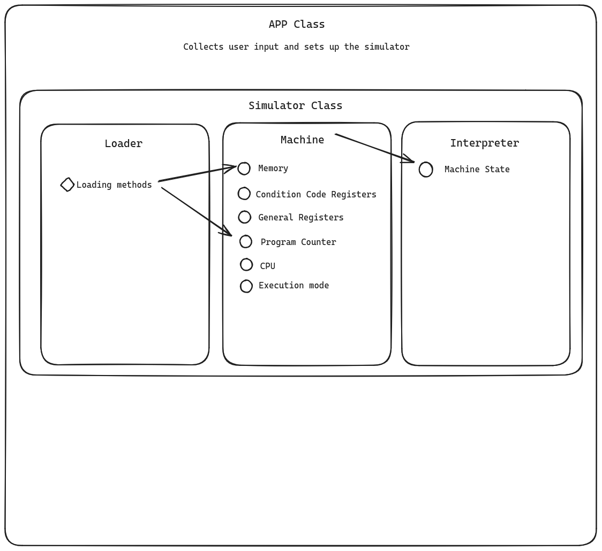

# Introduction
This programmer’s guide will cover the components of our simulator project which is an implementation of the "SP24-COLDX Machine" specification provided in CSE 3903. The guide will cover the structure of the project, how each component plays its part, the methods within these components, how they function, and any testing done to ensure proper functionality for all code implemented therein.

This guide will assume that the reader has a base level of understanding of the following topics:

- Instruction Sets
- Object Files
- Words
- Computer components and their purpose
  - Memory
  - CPU
  - Condition Code and General Purpose Registers
  - Program Counter
- Java Programming and Testing
- Object Oriented Programming Principles

# System Overview
The system is built with eight class components and a single `App` class that handles user input and setting up the simulation. The `Simulator` class owns the `Machine` that is constructs when instantiated, along with the `Loader1` object. When the `run()` function is called the `Simulator` then instantiates the `Interpreter` and begins running the simulation.



# Build System
The build system for this project is apache maven. It allows us to define dependencies and ensure that everyone development environment is building the same way. The `pom.xml` file in the root directory of the project contains our dependencies and build setup. This project is built into something nick named an *uber jar*. All this means is that all of out dependencies are packaged in the `jar` file when maven builds the project. This ensures that there cannot be any missing dependencies and once the project is built it cannot lose functionality. 

To build the project, run `mvn package` in the project root directory containing the `pom.xml` file. Maven will complain if you are not in the directory with the `pom.xml` file.
```
mvn package
```

The resulting `jar` file is place in the `target` directory named `giles-nebulas-simulator-1.0.jar`. To run this with the `App` interface that is built in use the command:
```
java -jar giles-nebulas-simulator-1.0.jar -q -l 20 -f [path to object file]
```
This will run the machine in `QUIET` mode with an upper limit on execution time of 20 seconds. 

To view a help message showing the possible running modes, execute the program with no arguments. The resulting message is:
```
Missing required options: l, f
usage: utility-name
 -f,--file <arg>    File path to object file
 -l,--limit <arg>   The upper time limit in seconds the sim is allowed to
                    run
 -q,--quiet         Run in quiet mode
 -s,--step          Run in step mode
 -t,--trace         Run in trace mode
```

# App Class

## Overview 
The App class is where we implement the front end of the application and instantiate our simulation. The information that the app collects ( like the modes, time limit, and file ), is passed to the simulator to be run. The App class only exists to act as a way to run the project. The rest of the classes to not depend on the App class or even know that it exists. This is intentional because the rest of the Simulator is designed to function as a packaged that you can import and use in an unrelated project. 

## App Implementation Description
The app implementation has a single main function. It stores no data and does not have any interaction with the simulation after setting it up and calling the `run()` function. This does not affect the rest of the project but App is where we collect the user information that is provided through the arguments and parse using the [`org.apache.commons.cli`](https://commons.apache.org/proper/commons-cli/) package.


# Machine Class

## Overview 
The Machine class is what keeps track of the state of the machine. It has a single constructor method that takes a `Machine.MODE` as an argument and stores it in a public member. The machine has no private member and exists simple as a way to organize the data in the model of a state machine.  
## Component Description
The machine has six public members: 
```
    public Machine.MODE mode;
    
    public CCR ccr;
    
    public Registers registers;

    public Word pc;

    public Word cpu;

    public Memory memory;
    
```
These are public so that the components that modify the machine such as the `Loader1` and the `Interpreter`can access its parts. 

### Client-side Description
The client description is simple. You can construct a machine like so:
```
Machine m = new Machine1(Machine.MODE.QUIET);
```
This will set the running mode to `QUIET` and instantiate all the public members. 


### Implementation Description
The Implementation of the single machine constructor is simple enough to read here:

```
    public Machine1(Machine.MODE runningModeInput){
        
        mode = runningModeInput;

        ccr = new CCR1();

        registers = new Registers1();

        pc = new Word1();

        cpu = new Word1();
        
        memory = new Memory1();

    }
```

# Condition Code Register Class

## Overview 
The Condition Code Registers are the three registers that hold the sign information of the last word written to a general purpose register. 

## Data Structure Design
The data structure behind this class is simple three private booleans.
```
    private boolean N;
    private boolean Z;
    private boolean P;
```

## Component Description

### Client-side Description
The client can use the three self descriptive get and set methods to access the registers state. 
```
public interface CCR{


    public boolean getN();


    public boolean getZ();


    public boolean getP();


    public void setN();


    public void setZ();


    public void setP();

}

```

### Implementation Description
The implementation of the registers is simple enough to read here:
```
    @Override
    public boolean getN() {
        return N;
    }

    @Override
    public boolean getZ() {
        return Z;
    }

    @Override
    public boolean getP() {
        return P;
    }

    @Override
    public void setN() {
        N = true;
        Z = false;
        P = false;
    }

    @Override
    public void setZ() {
        N = false;
        Z = true;
        P = false;
    }

    @Override
    public void setP() {
        N = false;
        Z = false;
        P = true;
    
```

This is the entire implementation.

# Registers Class

## Overview 

The `Registers` Class is a simple state machine similar to the machine and the Condition Code Register. It contains eight word objects ranging from 0-7. It has a single constructor that initializes the Registers to zero. It has two methods. One to get a register value aptly named `getRegister(int registerNumber)` and another to set the register `setRegister(int registerNumber, Word value)`

## Data Structure Design
The data structure design is simple eight word objects initialized in the constructor.
```
    public Registers1(){
        
        zero = new Word1();
        one = new Word1();
        two = new Word1();
        three = new Word1();
        four = new Word1();
        five = new Word1();
        six = new Word1();
        seven = new Word1();

    }
```

## Component Description

### Client-side Description
The client can access and set the register using the two methods discussed before. 

`getRegister(int registerNumber)`

`setRegister(int registerNumber, Word value)`

### Implementation Description
The implementation of this is a little long to include here but it is still simple. Both methods include a single swtich statement to determine the register to access and then return or set said register. 

# Word Class

## Overview 
The word class is the building blocks of the package. The words are the custom data structure that represents all of the data in the machine. The word is implemented using the `java.util.BitSet` library. 

## Data Structure Design
The data structure of the word is simply a single 16 bit instance of a `BitSet` that is initialized to zero by default. 

## Component Description

### Client-side Description
The client can interact with words using the ten provided methods. 
```
    boolean getBit(int position); 

    boolean setBit(int position, boolean value); 

    boolean equals(Word b); 

    Word add(Word b); 

    Word and(Word b); 

    Word not(); 

    int toInt();
    
    int sign();
    
    int bitsToInt(int start, int end);
    
    String bitsToString(int start, int end);
```

The only method that alters the current `BitSet` is `setBit(int position, boolean value)`. This method does exactly what it sounds like and sets the bit at the given position to the boolean value provided. 

### Implementation Description
 The `Word1` class in this Java Virtual Machine (JVM) project implements a 16-bit word using a `BitSet`, allowing for binary data manipulation and representation. It provides constructors for initializing `Word1` instances from integers, binary strings, and with sign extension capabilities. The class supports basic bitwise operations such as AND, NOT, and addition, alongside utility methods for converting between integer values and binary strings, setting and getting individual bits, and checking equality with other `Word` instances. Sign detection is implemented based on the most significant bit, with additional functionality to convert the binary representation to its integer value and vice versa. The design focuses on encapsulating the bitwise logic within a flexible, object-oriented framework that facilitates operations common in low-level machine simulation, such as arithmetic and logical operations on binary data.


# Loader Class

## Overview 
The `Loader1` class is responsible for taking a machine object and a file path and setting up the machine to be able to run. This is done with its single public method `loadMachine(Machine1 machine, String filepath)`. The `Loader1` focuses on initializing the machine's memory based on the contents of an object file. 

## Data Structure Design

The `Loader1` has four private members that it used to verify that the program that is being loaded is not loading any memory that is outside of its jurisdiction. 

```
    private int initLoadAddr;
    private int programLength;
    private int startAddr;
    private String name;
    
```

## Component Description

### Client-side Description

The client description is straight foreword. The client can only pass a machine and valid file path. If a invalid file path is provided then the `Loader1` will stop loading the machine and rise an error complaining about what specifically went wrong. 

### Implementation Description
The implementation of the `Loader1` is slightly more involved. First the `filepath` is checked by the function `checkForIllegalCharacter()` which will return true if it is allowed to continue and false if the file path has some issue. That issue may be that it doesn't exist or that it contains some invalid character data. 

It then attempts to parse the header and store information that is needed for parsing the text records in its private members. After the header is parsed in `parseHeader()` the `Loader1` calls `validStart()` to check that the load address that was given is valid and that the length of the program will not write outside of the defined memory depending on where the header record says that its going to start. 

Then the `Loader` will call `parseText()` which will iterate through the file parsing and loading the text records into memory. This method is important enough to include here:

```
    private void parseText(Machine1 m, BufferedReader br) throws IOException{

        String line;

        while ((line = br.readLine()) != null) {
            
            if(line.startsWith("T")){
                int address = Integer.parseInt(line.substring(1,5), 16);
                int contents = Integer.parseInt(line.substring(5,9),16);
                
                Word addressWord = new Word1(address);
                Word contentsWord = new Word1(contents);

                //Now try and insert into memory

                //But only if the address is in bounds
                if (address >= initLoadAddr && address <= initLoadAddr + programLength){
                    m.memory.setWord(addressWord, contentsWord);
                } else {
                    throw new IndexOutOfBoundsException("[ERROR] Tried to Load memory that is out of bounds"); 
                }


            } else if (line.startsWith("E")) {
                //Handle end record
                
                startAddr = Integer.parseInt(line.substring(1,5), 16);
                
            }
        }
    }
```

After parsing the text records the `Loader1` sets the `machine.pc` to start address collected in the end record and exits. 

# Interpreter Class

## Overview 

The `Interpreter` class serves as the core of a simulated machine's instruction execution engine, interfacing directly with a `Machine1` instance to sequentially interpret and execute a set of predefined instructions encoded within the machine's memory. Upon construction, it takes a reference to a `Machine1` object, which it uses to access and manipulate the machine's state, including its registers, memory, and program counter. The `step` method encapsulates the execution logic for a single instruction cycle, fetching the current instruction from memory, decoding its opcode, and dispatching to the appropriate handler method (e.g., `add`, `and`, `ld`, etc.) based on the opcode. Each handler method implements the semantics of the corresponding machine instruction, modifying the machine's state as appropriate. The class supports a range of instructions, from arithmetic and logical operations to memory access and control flow instructions, and includes a special `trap` method for system call emulation. Additionally, it offers a debugging utility (`dbug`) to inspect the machine's current state and supports a step-through mode for interactive execution control, enhancing the learning and debugging experience with the simulated machine environment.


## Data Structure Design

The Interpreter has two private members, the machine that it gets passed by the `Simulator` and the current instruction.

```
    Machine1 m;
    Word currentInstruction;

    public Interpreter(Machine1 machine){
        m = machine; 
    }
    
```

## Component Description

### Client-side Description
The client usage of the Interpreter is a constructor and two public methods. `step()` and `printState()`. 

The step method with process the address in the `m.pc` by copying the value to `currentInstruction`, incrementing the `m.pc` and executing the instruction. 

The `printState()` method is for use in the step and trace modes of execution. It will print the current page that the PC is on starting at the first word in that page and then listing the addresses and values in the following 512 memory locations, i.e. page. 

### Implementation Description
The implementation for the Interpreter is long but hopefully simple enough to understand. When `step()` is called it will copy the `m.pc` to the `currentInstruction`, increment the `m.pc` and then proceed to the following switch statement. 
```
        switch (opCode) {
            case "0001": //add
                add();
                if(m.mode != Machine.MODE.QUIET){ System.out.println("Executed ADD");}
                break;
            case "0101": //and
                and();
                if(m.mode != Machine.MODE.QUIET){ System.out.println("Executed AND");}
                break;
            case "0000": //brx
                brx();
                if(m.mode != Machine.MODE.QUIET){ System.out.println("Executed BRX");}
                break;
            case "1000": //dbug
                dbug();
                if(m.mode != Machine.MODE.QUIET){ System.out.println("Executed DBUG");}
                break;
            case "0100": //jsr
                jsr();
                if(m.mode != Machine.MODE.QUIET){ System.out.println("Executed JSR");}
                break;
            case "1100": //jsrr
                jsrr();     
                if(m.mode != Machine.MODE.QUIET){ System.out.println("Executed JSRR");}
                break;
            case "0010": //ld
                ld();
                if(m.mode != Machine.MODE.QUIET){ System.out.println("Executed LD");}
                break;
            case "1010": //ldi
                ldi();
                if(m.mode != Machine.MODE.QUIET){ System.out.println("Executed LDI");}
                break;
            case "0110": //ldr
                ldr();
                if(m.mode != Machine.MODE.QUIET){ System.out.println("Executed LDR");}
                break;
            case "1110": //lea
                lea();
                if(m.mode != Machine.MODE.QUIET){ System.out.println("Executed LEA");}
                break;
            case "1001": //not
                not();
                if(m.mode != Machine.MODE.QUIET){ System.out.println("Executed NOT");}
                break;
            case "1101": //ret
                ret();
                if(m.mode != Machine.MODE.QUIET){ System.out.println("Executed RET");}
                break;
            case "0011": //st
                st();
                if(m.mode != Machine.MODE.QUIET){ System.out.println("Executed ST");}
                break;
            case "1011": //sti
                sti();
                if(m.mode != Machine.MODE.QUIET){ System.out.println("Executed STI");}
                break;
            case "0111": //str
                str();
                if(m.mode != Machine.MODE.QUIET){ System.out.println("Executed STR");}
                break;
            case "1111": //trap
                trap();
                if(m.mode != Machine.MODE.QUIET){ System.out.println("Executed TRAP");}
                break;
        
            default:
                System.err.println("[ERROR] Word in CPU is not an instruction" + opCode);
                System.exit(1); 
                break;
        }
```

As you can see the statement take a string called `opCode` that the step method retrieves from the word and calls the corresponding function. Each individual function is too long to include here but will interface with the `m` Machine that is stored in the class to update the machine accordingly. The interpreter also has optional print statements that will print what instruction is being executed if you are in a mode that requires it. 

# Simulator Class

## Overview 

The `Simulator` class orchestrates the setup and execution of a virtual machine simulation, integrating components such as the machine itself (`Machine1`), a loader (`Loader1`), and an interpreter (`Interpreter`). Upon instantiation, it receives the file path for the machine code, the desired simulation run mode (`Machine.MODE`), and a specified runtime duration. The constructor initializes the `Machine1` instance with the run mode, utilizes the `Loader1` to load the machine state from the provided file, and handles any exceptions that might occur during the loading process. The `run` method controls the simulation's execution flow, utilizing an `Interpreter` instance to sequentially execute machine instructions. It supports different run modes, including a quiet mode for uninterrupted execution and a step mode that waits for user input between instructions, allowing for detailed examination of the machine's state at each step. The class also tracks the simulation's running time, ensuring that it does not exceed the specified duration when in quiet mode. This architecture facilitates a modular and extensible framework for simulating a virtual machine, emphasizing clarity, error handling, and user interactivity.

## Data Structure Design
The `Simulator` Contains four members that store the Machine, File path, runnning mode,  and required running time. 
```
    Machine1 machine;

    String filePath;
    
    private int runningTime;
    
    private Machine.MODE simRunMode;

```

## Component Description

### Client-side Description
The client simply passes the file path, mode of execution and run time limit to the constructor and the simulator begins to load the machine. 

```
public Simulator(String filepath, Machine.MODE M, int runTime)
```

Then when the user desired to run the simulation. The `run()` function is called. 


### Implementation Description

When `run()` is called the `Simulator` create an instance of the interpreter and passed the machine that has just been loaded by the `Loader1`. Then if it is not in Quiet mode it prints the state of the machine using `printState()` This is also where the running time is kept track of. 


```
 public void run(){
        
        //reader for user step
        
        BufferedReader reader = new BufferedReader(new InputStreamReader(System.in));
        
       //If trace or step print machine information 
        Interpreter interpreter = new Interpreter(machine);
        
        if(simRunMode != Machine.MODE.QUIET){
            interpreter.printState();
        }

        boolean continueExecution = true;
        
        long startsTime = System.nanoTime();

        while(continueExecution){
            continueExecution = interpreter.step();
            

            if ((System.nanoTime() - startsTime > runningTime) && simRunMode == Machine.MODE.QUIET){
                continueExecution = false;
            }
            

            //if trace or step mode, then wait for user input
            if (simRunMode == Machine.MODE.STEP) {
                waitForUser(reader);
            }

            
            
        }

         if(simRunMode != Machine.MODE.QUIET){
            interpreter.printState();
        }
       


    }
```

